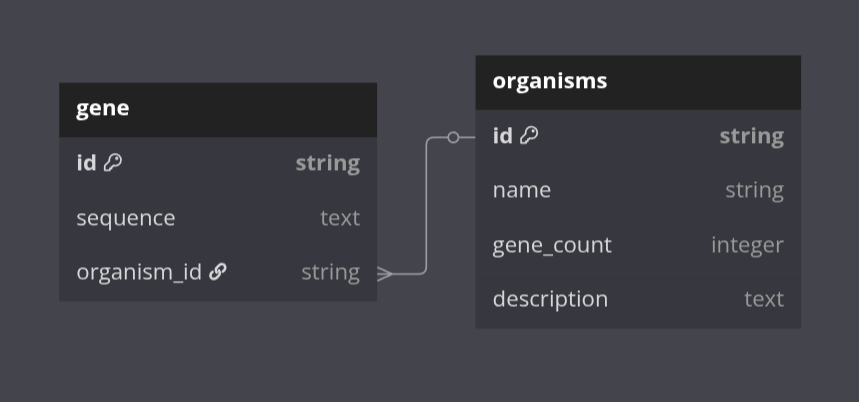

## Веб-интерфейс для хранения последовательностей генов конкретных организмов

### Схема БД:



### Скачивание и использование:

#### Склонируйте в любую удобную папку и перейдите в новый проект:
```bash
git clone git@github.com:ArtemVaska/DB_University.git && \
cd DB_University/
```

#### Скачайте необходимые зависимости для python 3.12:
```bash
pip install -r requirements.txt
```

#### Создайте новую базу данных (опционально):
```bash
python init_db.py
```

#### Запустите скрипт:
```bash
python run.py
```